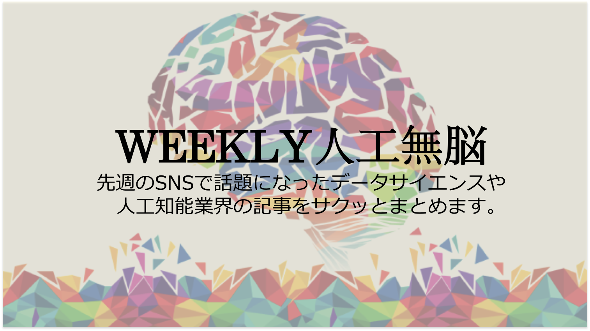

# WEEKLY人工無脳【第5号】（2018.5.7~5.13）

## ①Googleの電話予約AIシステムDuplex、ついに本物のAIみたいなものがでてきよった…

http://gigazine.net/news/20180509-google-duplex-ai-phone-system/

今週の一番の話題と言えばこれでしょう。Google I/O 2018のイベントで発表された「Goole Duplex」。Googleが数年かけて開発したという、「電話でのお店予約」という非常に限定したシチュエーションでのみ、ほとんど人間のように自然にやり取りをして予約を取り付けるAIシステムの話。

これまでごまんと、「AIで~~~できるようになった」みたいな話を聞いて、「それ、AIじゃなくて機械学習な」「AIじゃなくてただの深層学習な」ってツッコミを入れ続けていたけど、初めて「……なんやこれ…AIじゃん…」って思ってしまったやつ。

美容院とレストランに電話予約をしているデモが公開されたのだが、まだ聞いてない人はとにかくリンク先の音声を聞いて欲しい、凄すぎて笑ってしまうから。

合成音声には最近おなじみのWaveNetを利用しており、そのクオリティーは電話口の相手が機械だと事前に知らされていなければ気づくことができないレベル（というか、機械だと教えてもらってもそれでも信じられないレベル）。「あー」とか「えーと」というような繋ぎの言葉を意図的に挟み込んだり、相手からの質問に即答せずに敢えて時間を置いたりする「人間らしさの演出」まで入れている。もしも対応できなくなるとシステム側が自動で判断して人間とバトンタッチする機能もあり。また、あまりにも人間と区別がつかないので、電話開始時にこれはAIが発話していますよと事前に告知する透明性確保も検討されているらしい。

公開されたデモで特にやばいのは2つめの音声。男性声のAIがレストラン側の女性店員に電話する例。
おそらく女性は英語ネイティブではないうえ、文法もやや適当な感じ。それにもかかわらず自然な受け答えをしている。
特に驚いたのは、AI側が5名の予約をお願いする発言に対して、女性店員が「4名以上は予約できないけど、来たら座れると思うよ」と少しトリッキーな返答をしたのに対して、「じゃあどれくらい待ちそう？」とAIが自然な返答をするところ。マジか。
特定タスクの音声限定で、おそらく最もうまく会話できた例をデモとして公開しているだろうとはいえ、このナチュラルさはヤバイ。これの”AIオレオレ詐欺システム”みたいなのが作られちゃったら日本は間違いなく滅ぶ。

I/OイベントではDuplexとは別に、メールの予想入力補助機能のもっとスゴイやつ、みたいなものも公開されたが、ここまでくると人間のコミュニケーションとはなんぞや、という気分になってくるのは自分だけだろうか。
Duplexにしても、電話口の人間が機械に手加減してもらってるみたいでかわいそうに感じてくるし、もういっそグーグルはお店側にも「予約を受け付ける音声AI」を無料でバラ撒いて、それをお店が使うことで機械同士でよしなに通信してくれるのが最善の世界なんだろうな。ヒトがAIの活動を邪魔している、という気さえしてくる…

ここでは「電話でのお店予約」という限定したタスクをうまく解くシステムの紹介だが、囲碁ゲームに特化したAlphaGOがすぐに汎化されて将棋やチェスに展開されたように、おそらく類似の会話タスクは瞬く間に解かれるのだろう。

## ②Uber自動運転車死亡事故の続報。適合率/再現率のシビアな問題が明るみに。

https://gigazine.net/news/20180508-uber-fatal-crush-software-bug/

Uber自動運転車事故の続報記事で、自動運転システムは被害者が道を横断するのを検知していたが誤検知（false positive）とアルゴリズム側で判断し回避しなかったということが調査でわかったという話。

分類アルゴリズムの精度評価で、[適合率と再現率（誤検知と見逃し）のどちらを取るか](http://zellij.hatenablog.com/entry/20120214/p1)という話は必ず検討項目としてあがるのですが、特に自動運転や医療領域のような人の命に関わる領域の設計は非常に難しい。

Uberの件ではシステム判断問題として課題が残るものの、そもそもこういった死亡事故が起こった場合、責任は誰がとるのか、アルゴリズム設計者に瑕疵担保責任を問われたりしないかなど今後の法整備も気になるところです。

## ③サッカーよくわからんマンにもこれならなんとなくわかるぞ！サッカー試合状況の可視化

https://twitter.com/kubamichalczyk/status/992496514424561665?s=12

位置情報を追跡し、一番外側にいるメンバーを線で繋いでそれぞれのチームの領域を表示しているだけなのだが、見ていて非常に興味深いです。なんとなく両チームの領域が、守る場合は広く重なるように、攻める場合は相手のカバー領域外にメンバーを配置できると良さそうですが、プレー中の選手たちの脳内も実はこんな領域把握が行われているのでしょうか。ビジュアライゼーションとしては簡単なのに面白いなーと。

## ④画像認識技術をゲーム化させるセンスに嫉妬

https://japanese.engadget.com/2018/05/07/google-ai-emoji-scavenger-hunt/

画像認識能力を使った「絵文字版借り物競争」的なゲームをgoogleがリリース。TensorFlow.jsで動いているのでブラウザで起動する。URLにスマホからアクセスするだけでゲームをプレイできる。 [https://emojiscavengerhunt.withgoogle.com/](https://emojiscavengerhunt.withgoogle.com/)

画像認識性能が向上し、しかも技術者であれば比較的簡単に利用できるようになったことからも、「この機能で何か面白い画像系アプリとか作れないかな」と挑戦した技術者は山のようにいるだろう。
それでも、一般的な物体は検出できても、”植物の種類”のようなあまりにマニアックなものまでは識別できないこともあり、「何かできそうで、できない」という結論に達して開発を諦めた人もまた大勢いたはず。
そこをアイデアとUIUXの技術で子どもでも遊べてハマりそうなゲームを作ったところがさすが。

ちなみにこのゲームのUIUXには、シリコンバレーで活躍する日本人デザイナーの川島高さん（[@kawashima_san](https://twitter.com/kawashima_san)）も参画されている。
[http://www.takashikawashima.com/portfolio/](http://www.takashikawashima.com/portfolio/)

2018/4/23のTakramのpodcast「海外でデザインを仕事にする（後編）」でもお話されているので興味がある人は聞いてみると楽しいかも。

## ⑤PoseNetがブラウザーで駆動するところまでやってきたぞーーー！

https://shiropen.com/seamless/google-tensorflow-posenet

[OpenPose](https://github.com/CMU-Perceptual-Computing-Lab/openpose)から始まった骨格推定の感動もついにコードゼロで動くまでやってきた。こちらも同じくTensorFlow.jsで動いている。

PCでこちらの[URL](https://storage.googleapis.com/tfjs-models/demos/posenet/camera.html)を開いて、インカメラ使用を許可すると骨格推定が始まる。ヌルヌル動いててヤバイ。あまりにも簡単に、あまりにも正確に追跡されて笑ってしまう。「すべての人がAIを使えるように」というgoogleの思想を改めて実感した瞬間。

## ⑥葬式まであげたのに地獄から帰ってきやがったKinect

https://japanese.engadget.com/2018/05/07/kinect-for-azure/

Kinectの生産終了が決定し、一部では[お葬式](https://www.facebook.com/events/224619821407234/)まであげられて別れを惜しまれたKinectが、しれっと第4世代として帰ってきた。我々の別れの言葉を返せと言いたい。

今度はAzureのもろもろと繋がり、センシングしたデータをより活用できそうな雰囲気が漂っている。スペックは以下。

>1024 x 1024 解像度のToF式奥行きセンサ、4K RGBカメラ、日光下での性能を向上させるグローバルシャッター、360度マイクアレイなどを備え、さまざまな用途に使いやすい小型と低消費電力が特徴です。

小型化したKinectモジュールをDJIのドローンなどにも搭載するなどエッジコンピューターの領域でも頑張っていくらしい。
それにしても最近のMSの他社とのコラボレーションはイケてる感じがする。MSの好感度が上がっていく…

ところで、Google I/Oでは2次元画像からのPoseNetでの（つまりソフトウェア的な）骨格推定が話題となり、MSはハードウェアを使っての物理センシング（人間の骨格推定以外のこともきっとできるだろうが。）という戦略なので面白い。今後の両方向の動向に注目したい。

それにしても復活嬉しい。おかえりKinectちゃん。

## ⑦カメラ画像の明暗修正にも機械学習

https://gigazine.net/news/20180511-see-in-the-dark/

https://twitter.com/hillbig/status/994014386447515650

学習と教師データもお手軽に作れるし、シンプルなアイデアだけになるほどーと関心した。また１つ、ハードウェア側の補正を（完全ではないが）ソフトウェア側で補えるようになった。カメラもまだまだ進化する。

## ⑧ありそうで無かったデータサイエンティスト採用方法が強い

https://twitter.com/maskedanl/status/993827385504972800

“イキリデータサイエンティスト”という言葉があるように（特にツイッターでよく見られる）、世の中のデータサイエンティストはなぜだか個性が強い人（オブラートに包んだ。）が多い印象で、入社したものの全く会社に合わないという人は少なからずいろんなところにいると思われるのです。
そこで！会社とマッチしなかったデータサイエンティストを対象に積極的に採用しますよという強気の採用広告。同時に世の中のデータサイエンティストニーズの高さも感じられます。

それにしても入社一ヶ月後というのはつまりまだ新卒研修とかしている会社がほとんどなわけで、そこで「この会社とは合わん！」と社員に思われてしまうほどダメな研修をしていると見限られてしまうということなのですね…会社側も研修も新卒だと思って適当にやってるとダメということね。。。

## ⑨AIがやってるのは「理論」的推論ではなく「直感」的推論？

https://togetter.com/li/1226711

Ponanza開発者の方のまとめツイート。
まとめツイートだけ読んでも「何のこっちゃ」と思っていたのだが、以下の方のツイートで何の話をしているのかわかった気が
する。

https://twitter.com/wildcard_takagi/status/994993108780642304

「理論」と「直感」は対極にあるものではなくて、使うデータの量が違うだけの同じ線上にある手法、という考え方はおもしろい。そう考えると機械学習がやってるのは「直感」だという言い方もわかる気がしますね。

## ⑩最近、ブレインマシンインターフェースの話題が気になる…

http://neuralism.hatenablog.jp/entry/2018/05/06/211541

最近自分の周りで何故かポツポツとブレインマシンインターフェース（BMI）の話題が増えていて、おすすめされた記事。
機械学習を用いた脳内認識活動の可視化など、最近話題になったネタの紹介や、脳の情報をインプット/アウトプットする方法などが簡単にまとめられている良記事です。

BMIの最終的に行き着く先が、各個人の脳を共有する地球規模のコネクトームだという、わりと良く聞く意外性のないオチなのでアレですが、近い将来我々の生活に入ってくる実用的なBMIなどんなものだろうかと夢が膨らむ。BMIなんてもっと未来の話だろうと思っていたのに、ソフトとハードの進化が最近異常に早いので意外に近くまできているのかもしれません…

余談ですが、文章中にイーロン・マスクとBMIへの言及があるのですが、イーロン・マスクは「我々はシュミレーションの中で生きている」というシュミレーション仮説の支持者らしいです。ちょっと本題から外れるかもですがシュミレーション仮説についてわかりやすく説明されている[こちらの記事](https://gigazine.net/news/20160816-elon-musk-living-simulation/)もおすすめ。

## ⑪物理学業界からのKaggleへの殴り込み。物理出身クラスターのデータサイエンティストはやっぱり燃えるの？

https://jp.techcrunch.com/2018/05/05/2018-05-04-particle-physics-gets-the-machine-learning-treatment-as-collider-data-multiplies/

珍しい（？）物理と機械学習の話。世界最大規模の素粒子物理学の研究所であるCERNが、加速器実験から得られるデータをkaggleに提供しコンペを開いている。賞金はやや少ないものの、実際の加速器のデータを扱えるので物理クラスター勢にはアツい話題なのかもしれない。

体系的な教育が行われないまま必要性によって盛り上がったデータサイエンス領域は、多くの人材を物理学専攻の学生から得ている雰囲気がある。物理学を学んでいた学生は、理論的な考え方はもちろん、プログラミング、統計学、数学とデータサイエンスに必要なスキルセットと被りが多かったため、実際に現在活躍しているデータサイエンティストも物理畑出身の方が多い。CERNが出しているデータということもあって、意外に挑戦するデータサイエンティストは多いのかもしれない。